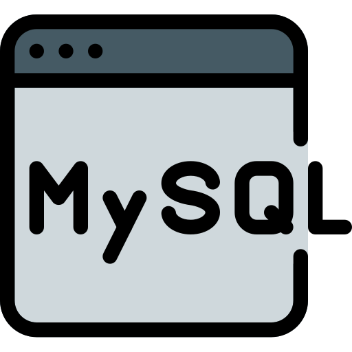

<h1 align="center">

    <p>
    MYSQL Sandbox
    </p>
</h1>


# Getting started
This is the backend for mysql-sandbox. This is a online real database program to test your mysql queries.

You can see a demo [here](https://mysql-sandbox.nullx.me/)
# Develop
## Requirements
* Docker
## Building
This repo has two containers:
* MySQL container
  * Port exposed: [6603](https://github.com/nullxx/mysql-sandbox-server/blob/f4a2241f4075c50d4b57b49ac165dcf438956ecc/docker-compose.yml#L6)
* api container
  * Port exposed: [3001](https://github.com/nullxx/mysql-sandbox-server/blob/f4a2241f4075c50d4b57b49ac165dcf438956ecc/docker-compose.yml#L12)
* Place environment variables
```bash
cp ./nodejs-microservice/.env.example .env
```
* Edit ```.env```variable with your favourite text editor
```bash
nano .env
```
* Run it
```bash
docker-compose up --build
```


## Attribution
<div>Icon designed by <a href="https://www.flaticon.es/autores/pixel-perfect" title="Pixel perfect">Pixel perfect</a> from <a href="https://www.flaticon.es/" title="Flaticon">www.flaticon.es</a></div>
